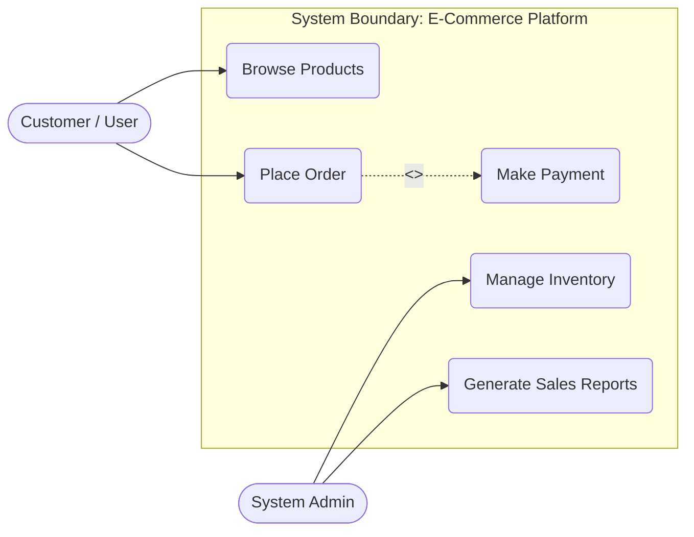
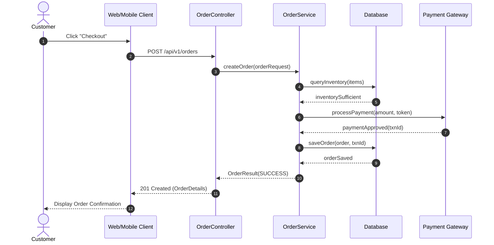
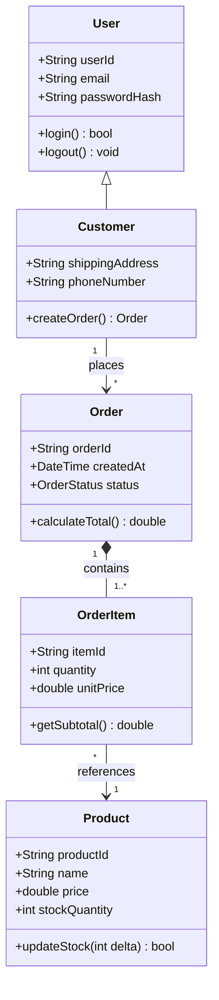

# ISAD (Information System Analysis & Design) Reference Guide

This reference provides standard templates, diagram patterns, and documentation structures for the **Information System Analysis and Design for Software Engineering** course.

---

## 1. UML Modeling Conventions with Mermaid

Always prefer Mermaid for UML modeling in documentation because it renders natively in GitHub, GitLab, and Markdown readers without external binaries.

### Use Case Diagram (System Boundary)


### Sequence Diagram (Interaction Flow)


### Class Diagram (Domain Model & Architecture)


---

## 2. Standard Use Case Specification Template

When authoring detailed specifications for the project:

```markdown
### Use Case: UC-01 [Use Case Name]
- **ID & Title**: UC-01 [Short descriptive name]
- **Primary Actor**: [e.g., Customer, Warehouse Staff, Admin]
- **Preconditions**:
  1. Actor must be authenticated.
  2. [Condition 2]
- **Postconditions**:
  1. Transaction record created and committed in DB.
  2. Notification sent to actor.
- **Main Success Scenario (Happy Path)**:
  1. Actor initiates action X.
  2. System validates input against business rules.
  3. System updates domain entities.
  4. System confirms success to actor.
- **Alternative / Exception Flows**:
  - *3a. Validation failed*: System returns specific validation error; actor can re-enter.
  - *4a. Third-party service timeout*: System logs failure, rolls back transaction, alerts user.
- **Non-Functional Requirements**:
  - Response time < 500ms under normal load.
  - Audit trail logged with actor ID and timestamp.
```

---

## 3. SRS (Software Requirements Specification) Outline (IEEE 830)

When writing or reviewing the project report:
1. **Introduction**: Purpose, Scope, Definitions, References, Overview.
2. **Overall Description**: Product perspective, User classes & characteristics, Operating environment, Design constraints, Assumptions & dependencies.
3. **System Features & Functional Requirements**: Grouped by subsystem or use case.
4. **External Interface Requirements**: User Interfaces (UI mockups), Hardware interfaces, Software interfaces (APIs), Communication interfaces (HTTP/JSON, WebSockets).
5. **Non-Functional Requirements (FURPS+)**:
   - Functionality, Usability, Reliability (MTBF, availability), Performance (throughput, latency), Supportability (maintainability, testability).
