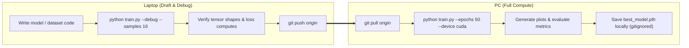

# Smart System (AI / ML / DL / CNN) Reference Guide

This reference provides PyTorch architecture patterns, headless training templates, and the dual-device training protocol for **Developing Smart Systems**.

---

## 1. Dual-Device Execution Protocol



> [!CAUTION]
> **Large File Safety Rules**:
> - Never commit `.pt`, `.pth`, `.h5`, `.onnx` weight files or raw datasets (`.csv`, `.zip`, images) to Git.
> - Only commit training code, plots (`.png` < 500KB), and metric logs (`results.json`).

---

## 2. PyTorch Modular CNN Skeleton

```python
import torch
import torch.nn as nn
import torch.nn.functional as F

class StandardCNN(nn.Module):
    """
    Modular Convolutional Neural Network suitable for CIFAR-10, MNIST, or custom image tasks.
    """
    def __init__(self, in_channels: int = 3, num_classes: int = 10, dropout: float = 0.25):
        super().__init__()
        # Conv Block 1
        self.conv1 = nn.Conv2d(in_channels, 32, kernel_size=3, padding=1)
        self.bn1 = nn.BatchNorm2d(32)
        self.conv2 = nn.Conv2d(32, 64, kernel_size=3, padding=1)
        self.bn2 = nn.BatchNorm2d(64)
        self.pool1 = nn.MaxPool2d(2, 2)
        self.drop1 = nn.Dropout2d(dropout)

        # Conv Block 2
        self.conv3 = nn.Conv2d(64, 128, kernel_size=3, padding=1)
        self.bn3 = nn.BatchNorm2d(128)
        self.pool2 = nn.MaxPool2d(2, 2)
        self.drop2 = nn.Dropout2d(dropout)

        # Classifier Head
        self.gap = nn.AdaptiveAvgPool2d((1, 1))
        self.fc1 = nn.Linear(128, 64)
        self.drop3 = nn.Dropout(dropout)
        self.fc2 = nn.Linear(64, num_classes)

    def forward(self, x: torch.Tensor) -> torch.Tensor:
        x = F.relu(self.bn1(self.conv1(x)))
        x = F.relu(self.bn2(self.conv2(x)))
        x = self.drop1(self.pool1(x))

        x = F.relu(self.bn3(self.conv3(x)))
        x = self.drop2(self.pool2(x))

        x = self.gap(x)
        x = torch.flatten(x, 1)
        x = F.relu(self.fc1(x))
        x = self.drop3(x)
        return self.fc2(x)
```

---

## 3. Headless Training Template with Mini-Batch Debug Mode

Include this dual-mode structure in your training scripts:

```python
import argparse
import os
import json
import torch
import torch.nn as nn
from torch.utils.data import DataLoader, Subset

def parse_args():
    parser = argparse.ArgumentParser(description="Train CNN model")
    parser.add_argument("--epochs", type=int, default=30)
    parser.add_argument("--batch-size", type=int, default=64)
    parser.add_argument("--lr", type=float, default=1e-3)
    parser.add_argument("--debug", action="store_true", help="Run 1 epoch on 20 samples to verify logic (Laptop mode)")
    parser.add_argument("--device", type=str, default="cuda" if torch.cuda.is_available() else "cpu")
    return parser.parse_args()

def run_training():
    args = parse_args()
    print(f"🚀 Running on Device: {args.device} | Debug Mode: {args.debug}")

    # Dataset loading logic here...
    # If args.debug is True:
    #   train_dataset = Subset(train_dataset, range(min(32, len(train_dataset))))
    #   args.epochs = 1
    #   args.batch_size = 8

    # Training Loop with Early Stopping & Best Metric Checkpoint...
```

---

## 4. Evaluation Checklist
Before submitting assignments or presentations:
- [ ] Confusion Matrix generated and saved to `reports/confusion_matrix.png`.
- [ ] Classification Report: Per-class Precision, Recall, F1-Score recorded in Markdown.
- [ ] Training vs. Validation Loss and Accuracy curves plotted.
- [ ] Overfitting check: Verify gap between training accuracy and validation accuracy is acceptable (< 10%).
