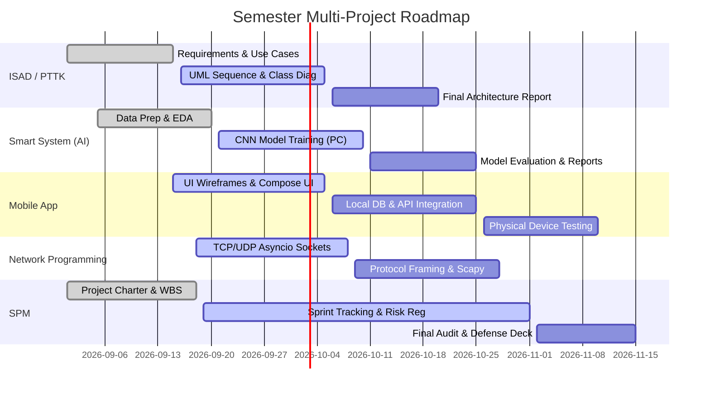

# SPM (Software Project Management) Reference Guide

This reference provides Work Breakdown Structure (WBS) patterns, Gantt chart scheduling templates, Agile sprint tracking, and risk management matrices for **Software Project Management**.

---

## 1. Work Breakdown Structure (WBS) Template

Structure project activities hierarchically down to 8–16 hour work packages:

```markdown
1.0 Project Management & Governance
    1.1 Project Charter & Scope Statement
    1.2 Sprint Planning & WBS Breakdown
    1.3 Weekly Standup & Risk Review
2.0 Requirements Engineering & Architecture (ISAD)
    2.1 Stakeholder Interviews & SRS Document (IEEE 830)
    2.2 UML Modeling (Use Case, Sequence, Class Diagrams)
    2.3 Database Schema & API Contract Specification
3.0 Core Implementation Sprints
    3.1 Sprint 1: Foundation (Auth, DB Models, Base UI/Sockets)
    3.2 Sprint 2: Core Feature Implementation
    3.3 Sprint 3: Advanced Integrations & Optimization
4.0 Quality Assurance & Testing
    4.1 Unit & Integration Testing
    4.2 Performance, Load & Security Testing
    4.3 User Acceptance Testing (UAT)
5.0 Deployment, Documentation & Defense
    5.1 Release Packaging & Deployment Scripting
    5.2 User Manual & Technical Documentation
    5.3 Defense Slide Deck & Live Demo Dry-Run
```

---

## 2. Project Schedule Gantt Chart (Mermaid)



---

## 3. Risk Management Matrix

| Risk ID | Description | Likelihood (1-5) | Impact (1-5) | Severity (LxI) | Mitigation Strategy |
| :--- | :--- | :---: | :---: | :---: | :--- |
| **R-01** | CNN Training OOM on Laptop | 5 | 4 | **20 (High)** | Enforce `--debug` mini-batches on laptop. Only run full training on Desktop GPU. |
| **R-02** | Android Emulator freezes system | 5 | 4 | **20 (High)** | Connect physical phone via USB / Wi-Fi ADB. Do not launch AVD on laptop. |
| **R-03** | Git conflict between Laptop & PC | 3 | 3 | **9 (Medium)**| Use `sync_checkpoint.sh` before leaving laptop and upon sitting at PC. |
| **R-04** | Large datasets accidentally committed | 4 | 4 | **16 (High)** | Gitignore all `.csv`, `.zip`, `.pt`, `.h5`, `.apk` files; pre-commit scan. |
| **R-05** | Overlapping project assignment deadlines | 4 | 5 | **20 (High)** | Daily standup check with Master Orchestrator via `PROJECTS_DASHBOARD.md`. |

---

## 4. Agile Sprint Review Checklist
- [ ] Sprint Goal defined and aligned with syllabus milestones.
- [ ] User stories estimated using Fibonacci scale (1, 2, 3, 5, 8 points).
- [ ] Blockers identified and logged in `PROJECTS_DASHBOARD.md`.
- [ ] Code committed with descriptive commit messages and pushed to remote.
